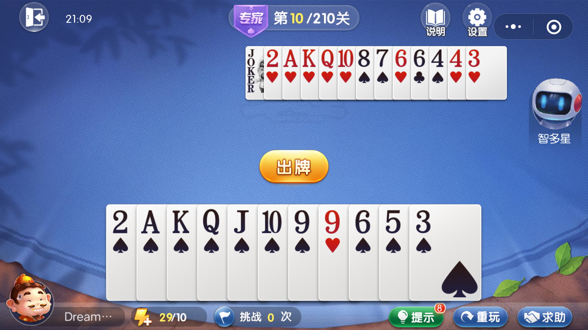

# 斗地主残局分析器


## info

项目想法来自于（欢乐）斗地主的残局模式。

下图为专家模式第 10 关



在残局模式中，玩家作为地主，先手出牌，对手是一名机器人农民，彼此明牌对局。

问，在这种情况下，如何才能赢？


## usage

```
$ python main.py
```

对局开始，运行程序，输入双方手牌。

之后程序会推断玩家应该出什么牌，然后我们将相同的牌输入游戏；
同时在游戏中，机器人会打出相应的牌，然后我们要将相同的牌输入程序，以保持交互。


以专家模式的第 10 关为例，实际游戏情况（点击链接到视频）：

[](https://dreamanddead-github-io.oss-cn-hongkong.aliyuncs.com/joker/fight.mp4)

程序运行情况（点击链接到视频）：

[](https://dreamanddead-github-io.oss-cn-hongkong.aliyuncs.com/joker/joker.mp4)


## algo

程序使用 minmax 对抗搜索算法，两人打牌完全明牌（信息共享），非输即赢（零和博弈且没有平局）。

最大手牌张数为 20 张，算法运行也没有太大压力（py 单线程加上缓存机制），所有问题分钟内可以出答案。


